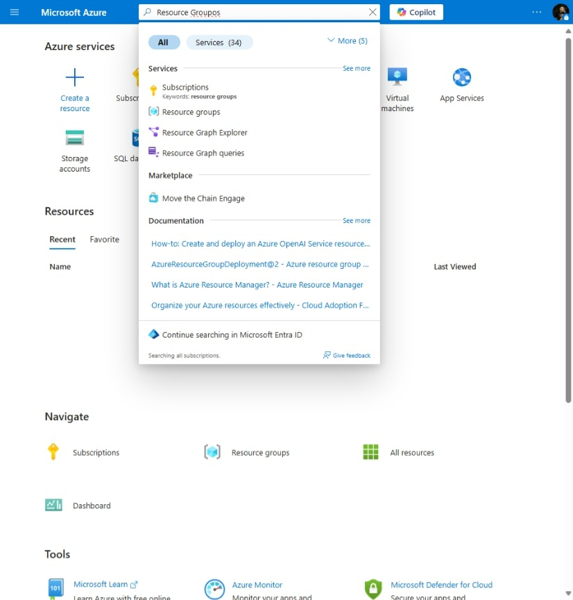

# AI Document Intelligence

[Previous step](../../README.md) - [Next step](../step-02/README.md)

## Step 1 - Create an Azure resource group

Log into the Azure Portal, use the search bar or homepage to find "Resource Groups", and create a new one with your subscription account:



Create the resource group inside your selected subscription and Germany West Central region (for this lesson):

```
rg-ai-doc-intelligence-gwc
```


[Previous step](../../README.md) - [Next step](../step-02/README.md)