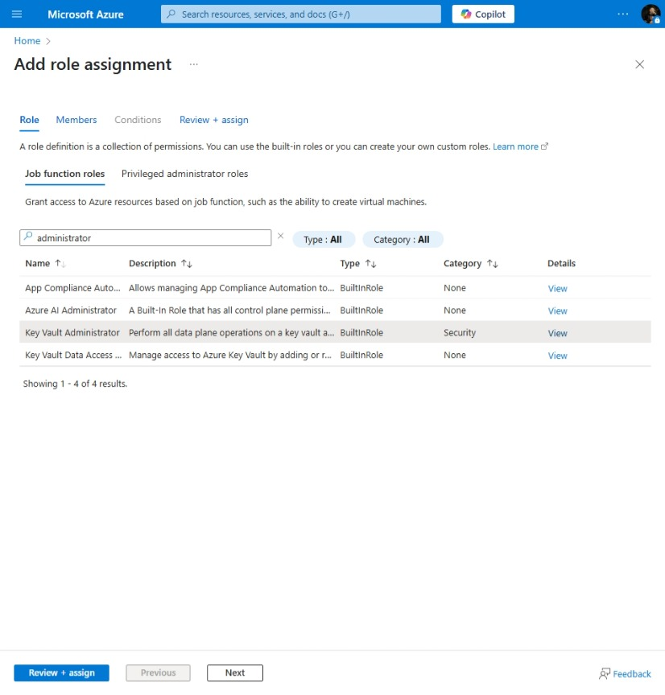

# AI Document Intelligence

[Previous step](../step-01/README.md) - [Next step](../step-03/README.md)

## Step 2 - Create and Deploy the Azure Key Vault

**1.** In the Azure Portal, search for "Key Vaults" and click Create to start the setup.


**2.** Fill in the details using the same resource group you created in the previous step `rg-ai-doc-intelligence-gwc`, and choose the Germany West Central region.


Use a consistent and descriptive name, such as:

```
kvAiDocIntelligenceGwc
```

**3.** After creating the Key Vault, go to it, open Access control (IAM), click Add > Add role assignment, search for Key Vault Administrator, click it, then click Next to proceed with assigning




**4.** On the Members tab click Select members and add your own account by clicking Select


**5.** Click Review + assign


Now you can add Secrets to your Azure Key Vault

[Previous step](../step-01/README.md) - [Next step](../step-03/README.md)