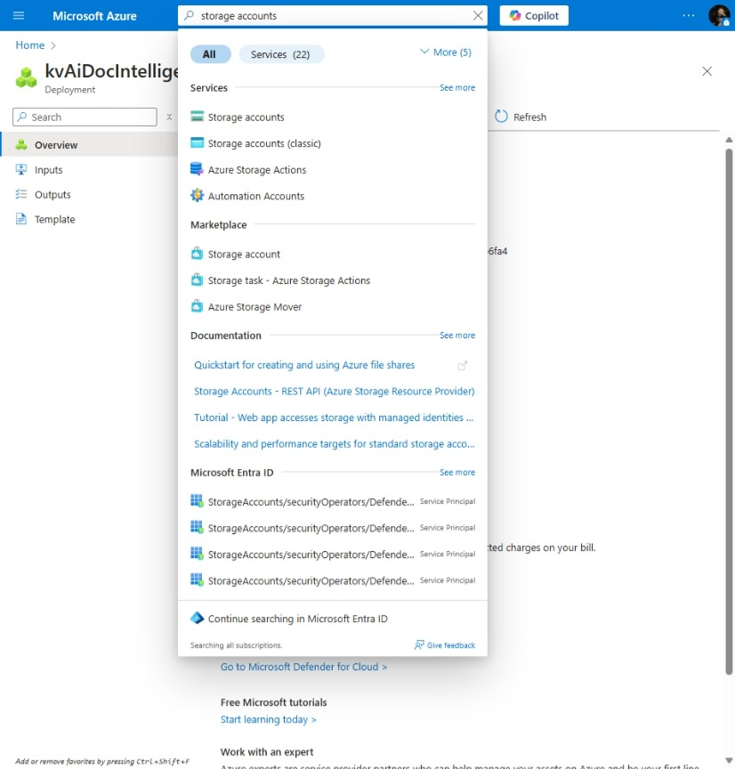
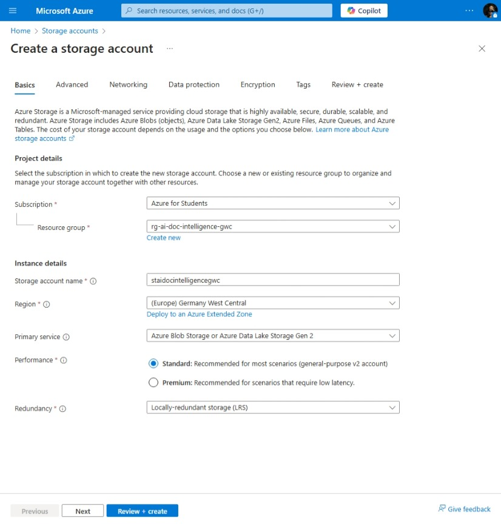
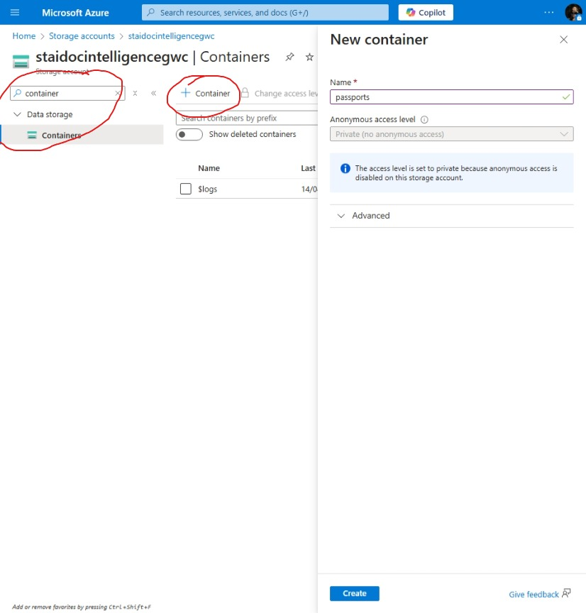
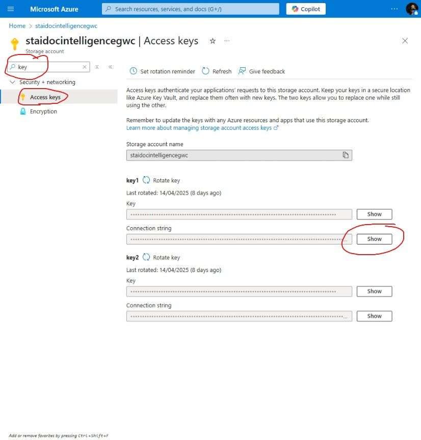
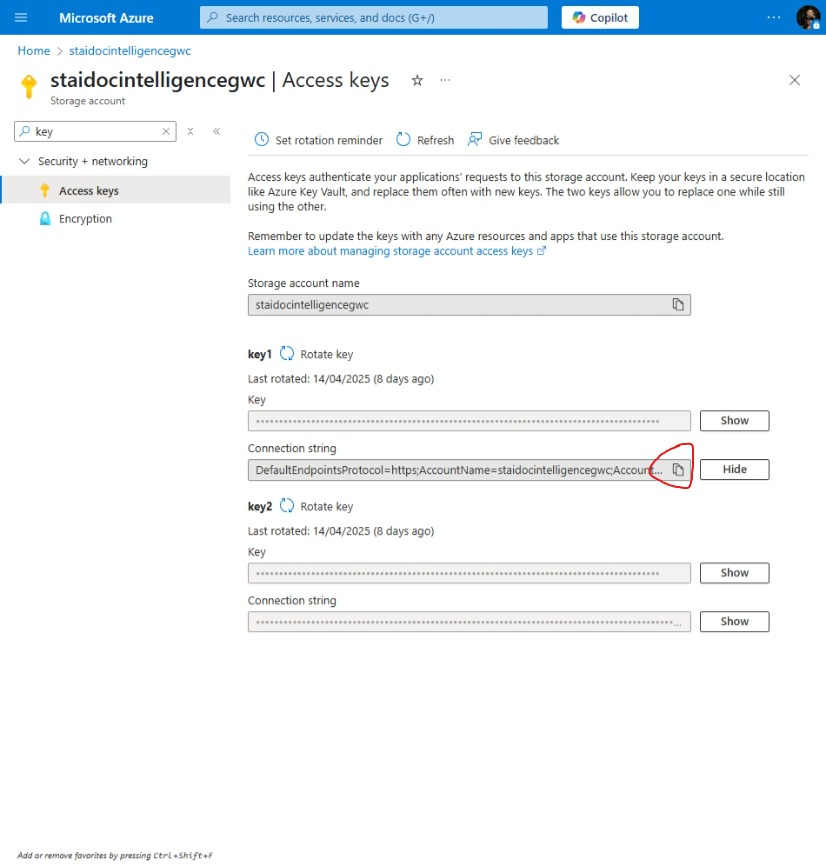
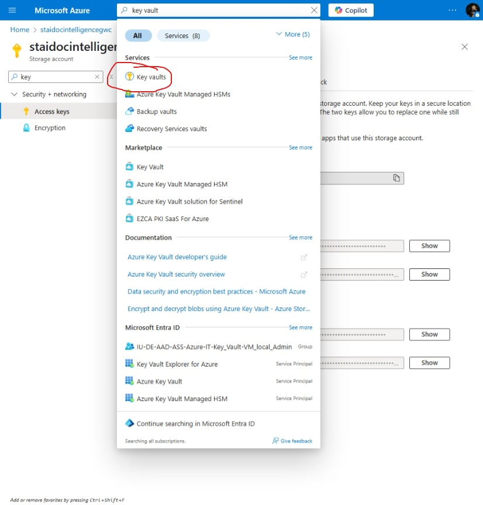
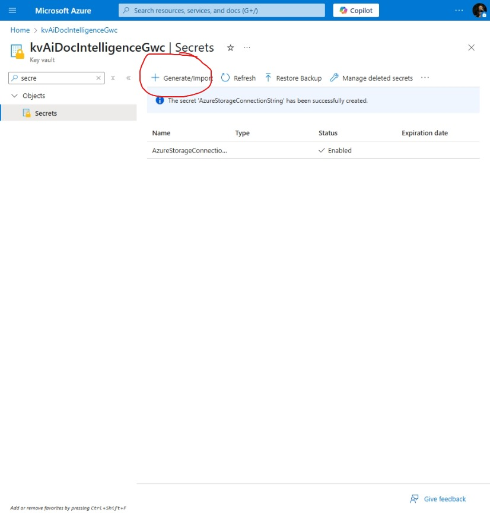
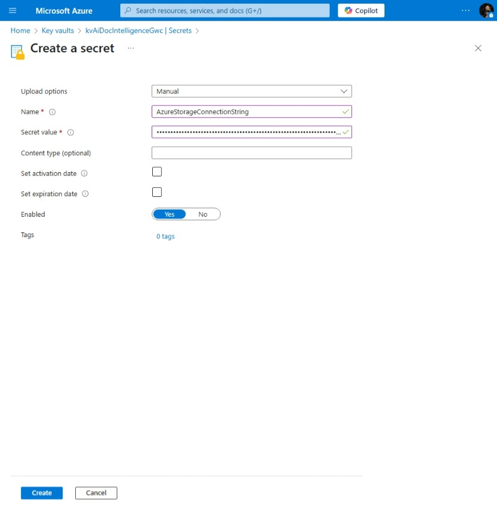

# AI Document Intelligence

[Previous step](../step-02/README.md) - [Next step](../step-04/README.md)

## Step 3 - Create Storage Account with Azure Blob Storage

**1.** In the Azure Portal, search for "Storage accounts" and click Create.



**2.** Use the same resource group `rg-ai-doc-intelligence-gwc` and Germany West Central region. Choose a unique name for your storage account, such as:

```
rg-cloud-native-app-west-europe
```



**3.** In the Azure Portal, go to your Storage Account, open the Containers tab from the left-hand menu, click + Container, name it `passports`, and click Create.



**4.** In the Storage Account, search for "Keys", go to the Access keys tab, click Show next to the connection string, and copy its value using the copy button.





**5.** Find the key vault s in the search bar and navigate to the key vault. Search for the keys and click the generate/import button to add the Storage Account connection string





**6.** Set the name to `AzureStorageConnectionString`, paste the Storage Account connection string as the value, and click Create.



[Previous step](../step-02/README.md) - [Next step](../step-04/README.md)