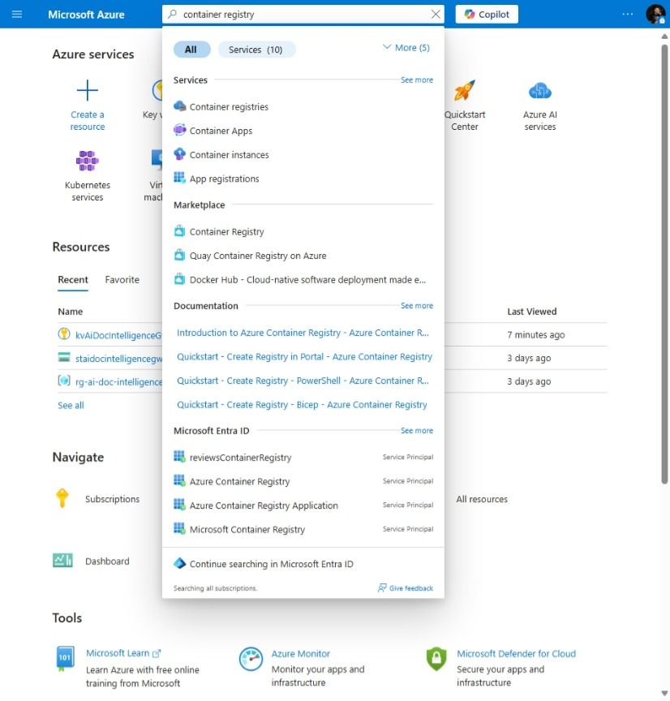
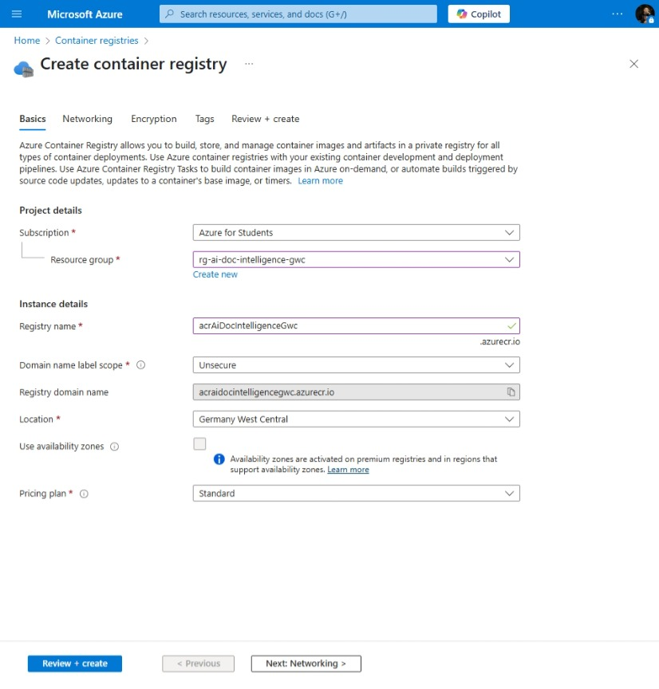

# AI Document Intelligence

[Previous step](../step-03/README.md) - [Next step](../step-05/README.md)

## Step 4 - Create Azure Container Registry

**1.** Find Cntainer Registry in the Azure portal search:

**2.** Click **Create**, select the resource group `rg-ai-doc-intelligence-gwc`, and name the registry `acrAiDocIntelligenceGwc` for easy identification.

No additional changes needed; complete the wizard to create the registry

[Previous step](../step-03/README.md) - [Next step](../step-05/README.md)