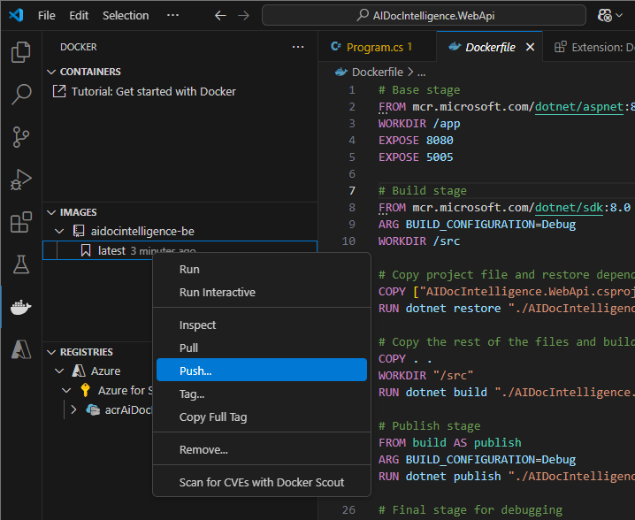

# AI Document Intelligence

[Previous step](../step-04/README.md) - [Next step](../step-06/README.md)

## Step 5 - Create the ACR (Azure Container Registry) resource in your Azure subscription

### Create the container registry

1. Search for "Container Registries" in the Azure portal:


2. Specify the container registry name and region:

```
acrCloudNativeAppWE
```


No further changes needed; complete the wizard to create the container registry.

### Link the container registry to Kubernetes

You are going to grant the Kubernetes cluster access to the container registry to push and pull Docker images

1. Run the command from the Visual Studio Code terminal to grant an AKS cluster access to an ACR:

```
az aks update -g <resource-group> -n <aks-name> --attach-acr <acr-name>
```

```
az aks update -g rg-cloud-native-app-west-europe -n aks-cloud-native-app-we --attach-acr acrCloudNativeAppWE
```

2. In Visual Studio Code, open Kubernetes from the Activity Bar and select your cluster in the Azure Cloud pane:


3. Right-click your Kubernetes cluster and merge it into your local Kubeconfig:



4. Set your Kubernetes cluster as the current cluster in the Clusters pane:


[Previous step](../step-04/README.md) - [Next step](../step-06/README.md)