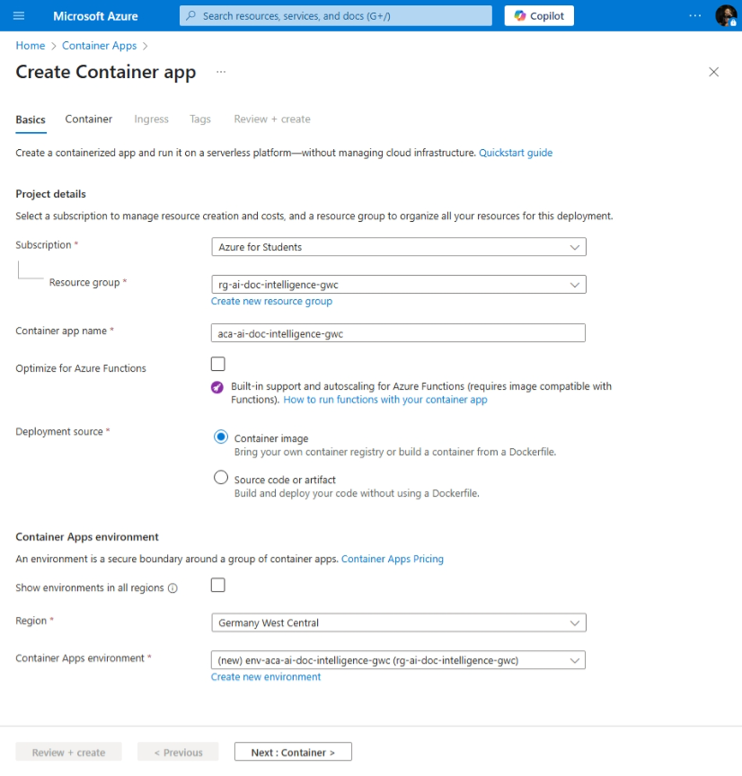
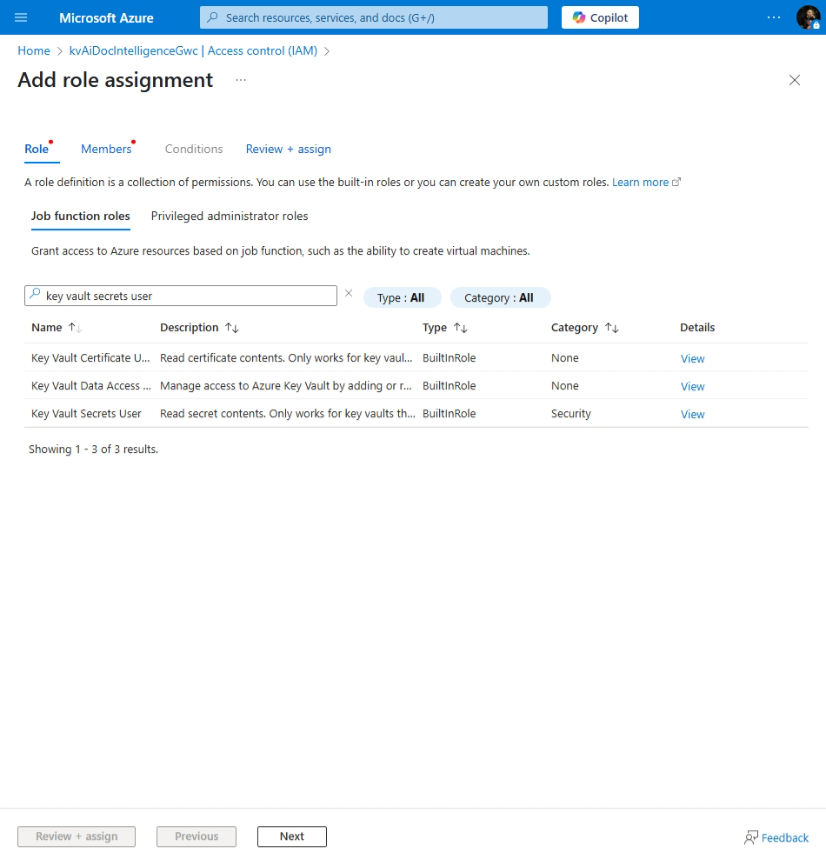
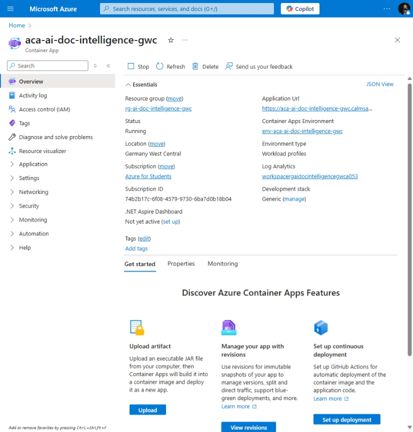

# AI Document Intelligence

[Previous step](../step-04/README.md) - [Next step](../step-06/README.md)

## Step 5 - Deploy the Backend API (with Blob Storage & Key Vault integration)

### Containerize the Backend API

1. Ensure Docker is running on your machine.  

2. Open the Web API project in Visual Studio Code, right-click the **Dockerfile**, and select **Build Image...** from the context menu.

3. When prompted, name the image `aidocintelligence-be:latest` and press **Enter**.

4. In the Docker extenstion of the visual studio code login into the azure container registry if needed

5. Right-click the backend image, select Push, then follow the prompts to choose your Azure subscription and container registry to push the image.

6. After pushing the image, go to your container registry in the Azure Portal, search for **Repositories**, and confirm that the image named `aidocintelligence-be` appears in the list.

### Deploying Backend API in Azure container apps

In the next steps, we will first create an **Azure Container Apps environment**, which provides the shared network and infrastructure for hosting containerized applications. Then, we'll deploy both the **backend and frontend** container apps into this environment, allowing them to securely communicate with each other.

7. Search for **Container Apps** in the Azure Portal, click **Create**, and then select **Container App**.

8. Give it a name `aca-ai-doc-intelligence-gwc` and select the **Germany West Central** as the region.

9. Click **Create new environment**, name it `env-aca-ai-doc-intelligence-gwc`, and then click **Create** to set up the Container Apps environment.

10. Click **Next**, select your container registry, and choose the backend image with the `latest` tag.

11. Click **Next**, enable **Ingress**, select **HTTP**, set the target port to **8080** (as defined in the Dockerfile), allow traffic from **Anywhere**, enable **Insecure connections**, then click **Review + Create** and wait for the container app to be deployed.

**12.** After the container app is deployed, go to its page in the Azure Portal. You’ll see an error — this happens because the app doesn’t yet have permission to access secrets from Azure Key Vault.

### Assigning Managed Identity with Key Vault Access to ACA

**13.** In the Container App settings, go to the **Identity** section, turn **System-assigned** identity to **On**, and click **Save**.

**14.** Go to your Azure Key Vault, search for **Access control (IAM)**, then click **Add > Add role assignment**.

**15.** In the role selection, search for **Key Vault Secrets User**, click on it, and then click **Next**.

**16.** Choose **Managed identity**, click **+ Select members**, search for and select your Container App (`aca-ai-doc-intelligence-gwc`), then click **Select**, followed by **Review + assign**.

**17.** Go back to your Azure Container App, click **Stop**, then click **Start** to restart it and apply the new permissions — the error should now be resolved.

**18.** Copy the **Application URL** from your Container App’s overview page, paste it into your browser, add `/passports` to the end, and hit Enter — seeing an empty array (`[]`) confirms the app is running and has access to Key Vault.

[Previous step](../step-04/README.md) - [Next step](../step-06/README.md)