# AI Document Intelligence

[Previous step](../step-05/README.md) - [Next step](../step-07/README.md)

## Step 6 - Deploy the Frontend UI

After we've hosted backend in the `aca-ai-doc-intelligence-gwc` azure container app now we have to host the fronend part of the application

**1.** Get the frontend part of the app from [this repository](https://github.com/ProgBloger/ai-document-intelligence-fe)

**2.** In the repository, go to `./ai-doc-intelligence-app/.env.production` and set the `BASE_URL` to the **Application URL** of the **backend Container App** you deployed earlier.

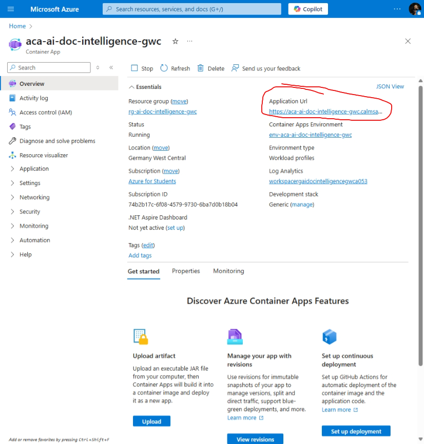

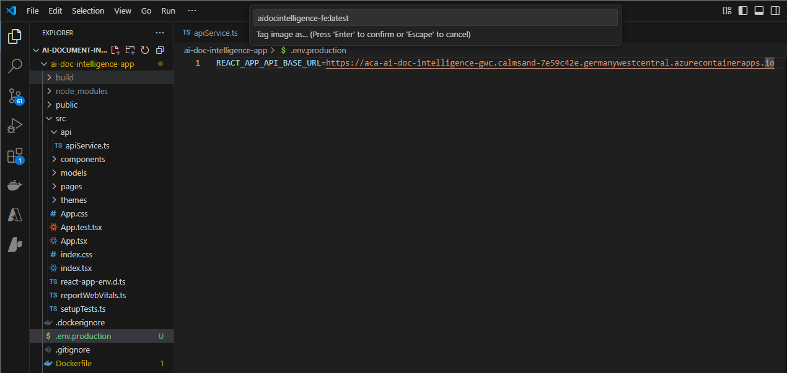

**3.** Right-click the **Dockerfile** in the frontend project and select **Build Image**.

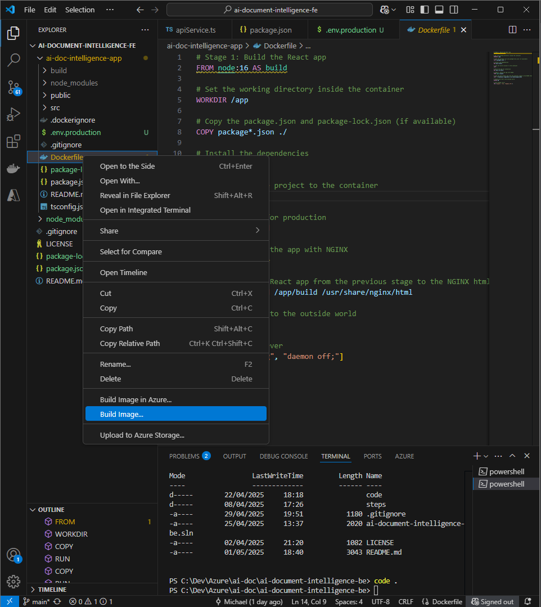

**4.** When prompted, name the image:

```
aidocintelligence-fe:latest
```

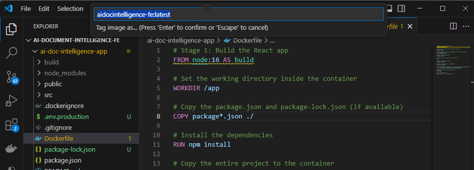

> ⚠️ **Tip:** If you encounter any issues, make sure **Docker Desktop** is running.

**4.** In the Docker extension panel of VS Code, locate the built image, right-click it, and select **Push** to upload it to your Azure Container Registry.

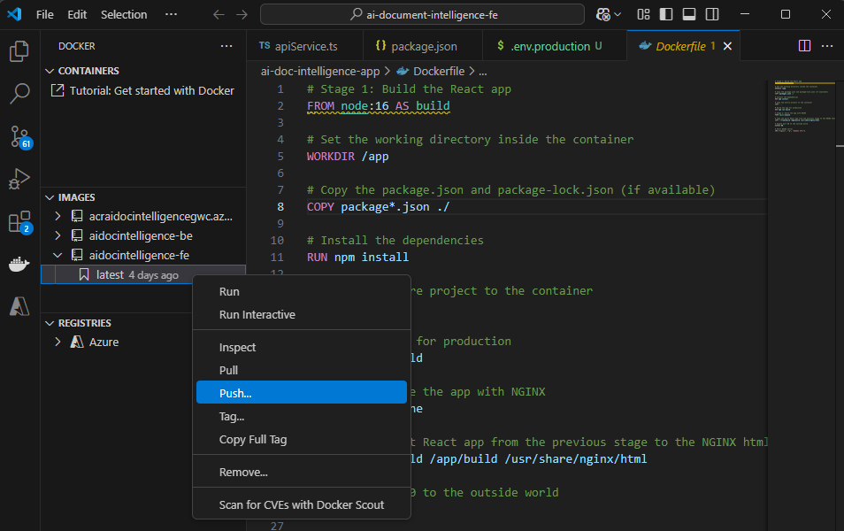

**5.** In the Azure Portal, go to your **Container Registry**, open the **Repositories** section, and confirm that the image has been successfully pushed and appears in the list.

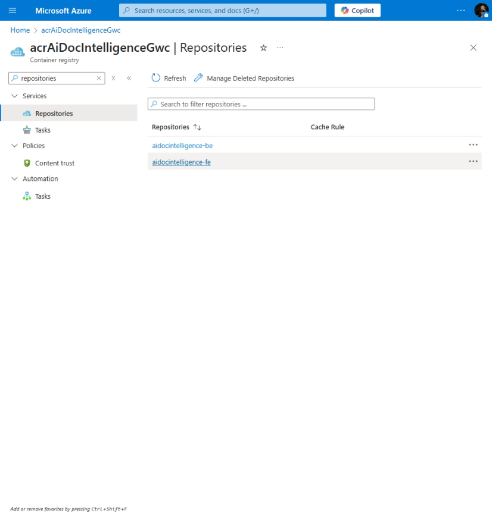

### Deploying Frontend UI to Azure Container Apps

With the image pushed, deploy the frontend as a **Container App** in the **same environment** as the backend so they can communicate internally.

**6.** Go to **Container Apps** in the Azure Portal, click **Create**, then select **Container App**.

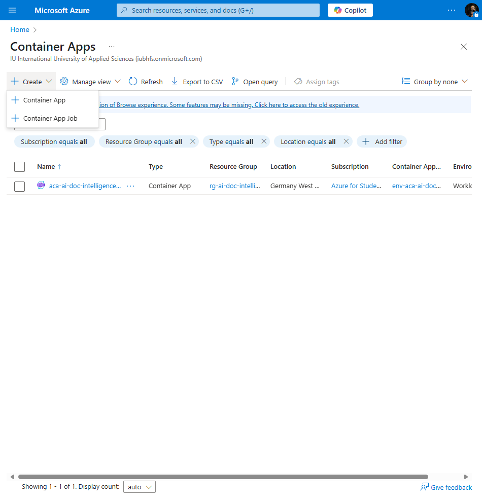

**7.** Select your resource group, name the app `fe-aca-ai-doc-intelligence-gwc`, choose the **Germany West Central** region, select the environment `env-aca-ai-doc-intelligence-gwc`, and click **Next**.

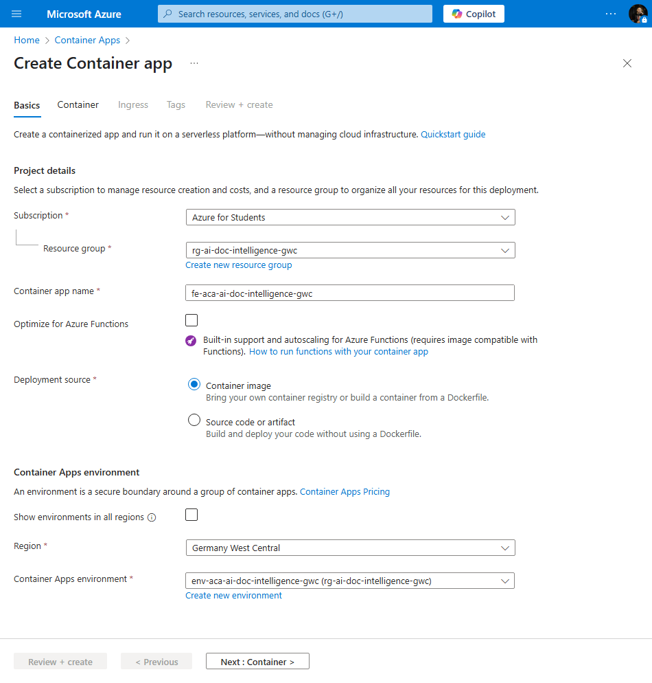

**8.** In the **Container Configuration** step, select your container registry, choose the `aidocintelligence-fe` image with the `latest` tag and click **Next**.

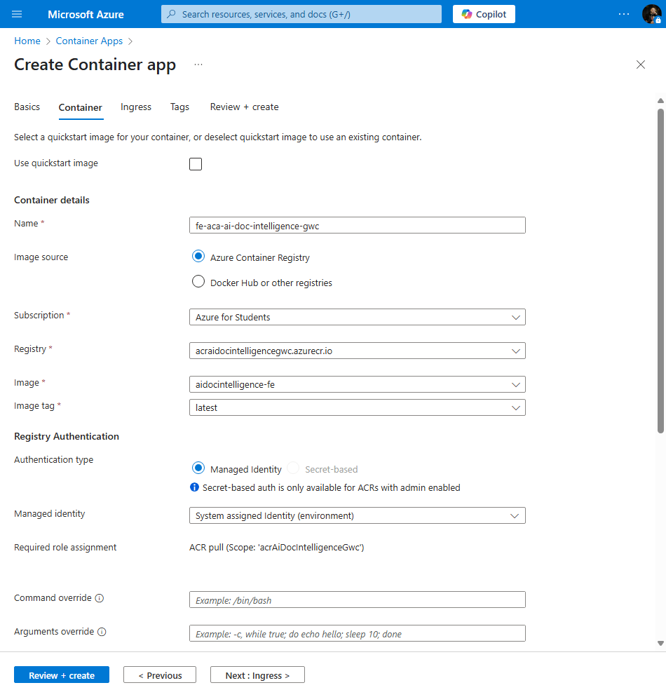

**9.** In the **Ingress** step, enable ingress, set it to accept traffic from **anywhere**, keep the ingress type as **HTTP**, set the **target port** to `80`.

That’s it — everything is ready! Now go ahead and create the Container App.

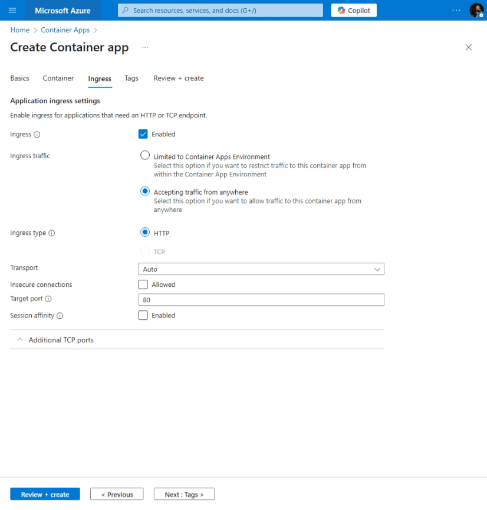

**10.** Go to your newly created Container App in the Azure Portal, copy the **Application URL**, and open it in your browser to view the frontend.

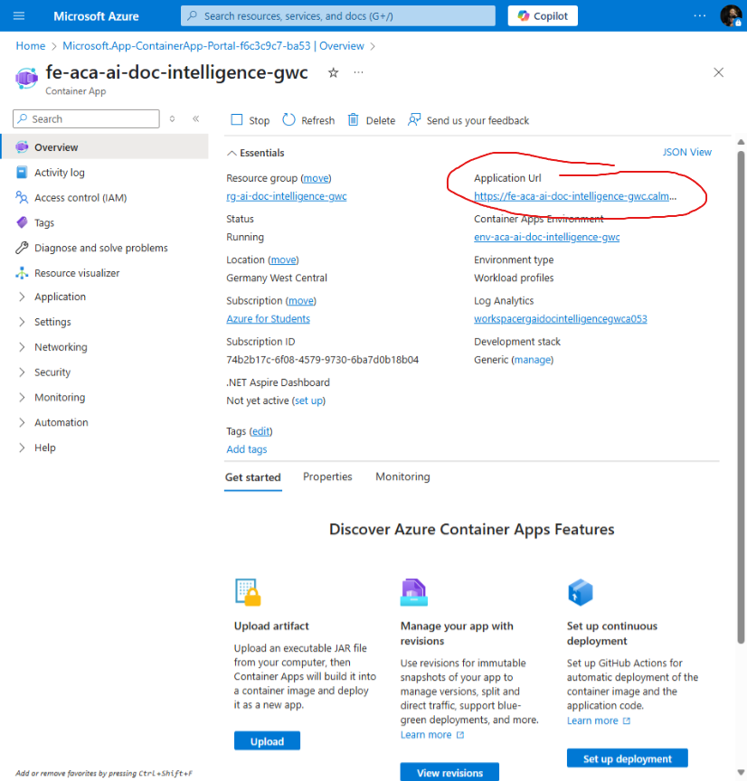

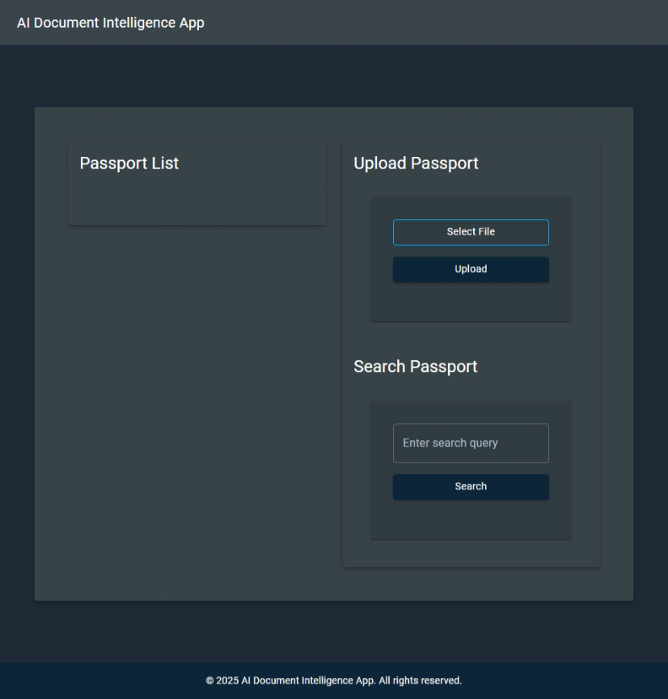

[Previous step](../step-05/README.md) - [Next step](../step-07/README.md)