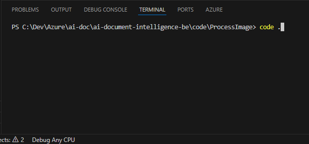
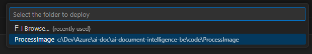
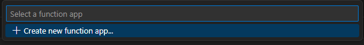
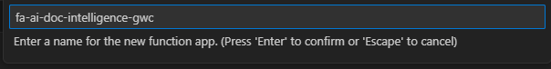
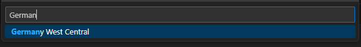
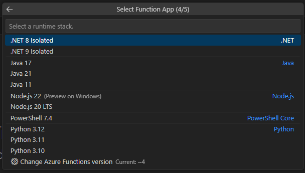
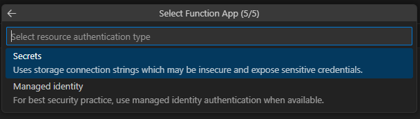

# AI Document Intelligence

[Previous step](../step-06/README.md) - [Next step](../step-08/README.md)

## Step 7 - Expose the ASP.NET Core WebApi as a network service

1. Move to the parent directory of the WorkerService folder, then execute `dotnet new webapi -n WebApi` to create a Web API project:



2. Open the newly created WebApi folder in Visual Studio Code.

3. Rename WeatherForecast to Status and update the API to return only the current machine name:

```csharp
var builder = WebApplication.CreateBuilder(args);

builder.Services.AddEndpointsApiExplorer();
builder.Services.AddSwaggerGen();

var app = builder.Build();

// Configure the HTTP request pipeline.
if (app.Environment.IsDevelopment())
{
    app.UseSwagger();
    app.UseSwaggerUI();
}

app.UseHttpsRedirection();

app.MapGet("/status", () =>
{
    return Environment.MachineName;
})
.WithName("Status")
.WithOpenApi();

app.Run();

```

4. Edit the `launchSettings.json` file to update the web API application's port to `8080`:


### Building the WebApi Docker image

1. Just like in step 02, add a Dockerfile using the Visual Studio Code command palette, selecting the ASP.NET Core application platform for Linux without optional Docker Compose files:



2. Right-click the Dockerfile and select "Build Image":



3. From the Docker Activity pane in Visual Studio Code, push the built image to your Azure Container Registry:





### Deploying WebApi to Kubernetes

1. Similar to step 06, create a Kubernetes deployment to deploy your WebApi container with 3 replicas, ensuring three Pods are always running:

```yaml
apiVersion: apps/v1
kind: Deployment
metadata:
  name: webapi
spec:
  replicas: 3
  selector:
    matchLabels:
      app: webapi
  template:
    metadata:
      labels:
        app: webapi
    spec:
      containers:
      - name: webapi
        image: acrcloudnativeappwe.azurecr.io/webapi:latest
        resources:
          limits:
            memory: "128Mi"
            cpu: "500m"
        ports:
        - containerPort: 8080
```

2. Apply the deployment script using the Visual Studio Code command palette:



3. In the Kubernetes Activity Bar, locate your running Pods:




[Previous step](../step-06/README.md) - [Next step](../step-08/README.md)