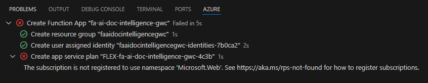
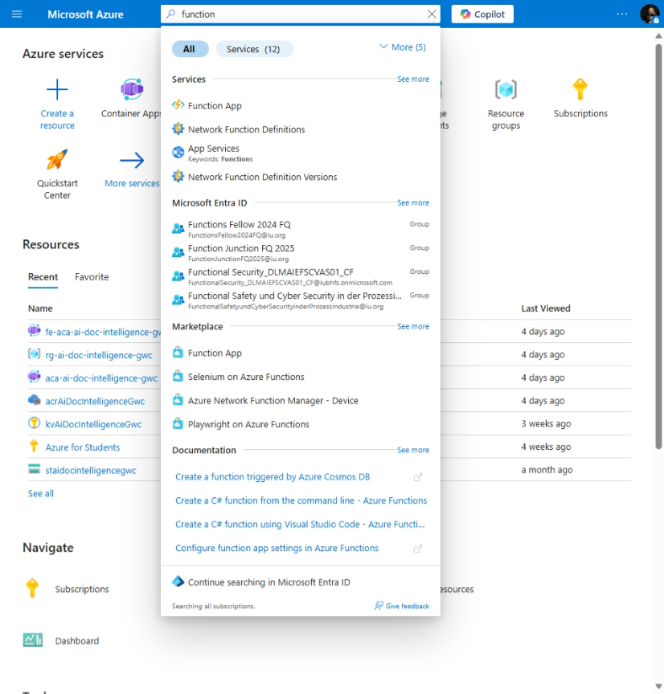
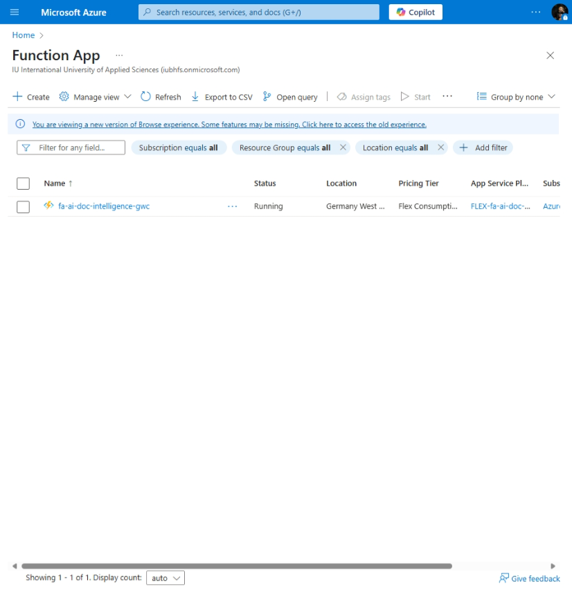

# AI Document Intelligence

[Previous step](../step-06/README.md) - [Next step](../step-08/README.md)

## Step 7 - Create and Deploy Azure Function

**1.** Navigate to the `ProcessImage` folder in your terminal and run the command:

```
code .
```


This will open the Azure Function project in Visual Studio Code.


Click the **Azure Function** icon in the Azure tab in Visual Studio Code, then select **Deploy to Azure** from the dropdown menu.


**2.** When prompted, select the folder containing your Azure Function project — the folder is named `ProcessImage`.


**3.** Choose **Create new Function App...**, and name it:

```
fa-ai-doc-intelligence-gwc
```


**4.** When prompted to select a location, choose **Germany West Central** for this example.


**5.** Select the .Net stack


**6.** Select **Managed Identity** as the authentication method, since the function will access secrets from Azure Key Vault and needs appropriate permissions.


**7.** If you see the error like *"The subscription is not registered to use namespace 'Microsoft.Web'"*, fix it by running the following commands in your terminal:

```
az provider register --namespace Microsoft.Web

az provider register --namespace Microsoft.Insights
```



Then retry the deployment steps

**8.** Go to the **Function App** section in the Azure Portal and verify that `fa-ai-doc-intelligence-gwc` has been successfully deployed and is in a **Running** state.





[Previous step](../step-06/README.md) - [Next step](../step-08/README.md)