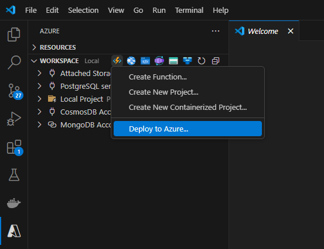

# AI Document Intelligence

[Previous step](../step-06/README.md) - [Next step](../step-08/README.md)

## Step 7 - Create and Deploy Azure Function

**1.** Navigate to the `ProcessImage` folder in your terminal and run the command:

```
code .
```


This will open the Azure Function project in Visual Studio Code.


Click the **Azure Function** icon in the Azure tab in Visual Studio Code, then select **Deploy to Azure** from the dropdown menu.



**2.** When prompted, select the folder containing your Azure Function project — the folder is named `ProcessImage`.


**3.** Choose **Create new Function App...**, and name it:

```
fa-ai-doc-intelligence-gwc
```


**4.** When prompted to select a location, choose **Germany West Central** for this example.


**5.** Select the .Net stack


**6.** Select **Managed Identity** as the authentication method, since the function will access secrets from Azure Key Vault and needs appropriate permissions.


**7.** If you see the error like *"The subscription is not registered to use namespace 'Microsoft.Web'"*, fix it by running the following commands in your terminal:

```
az provider register --namespace Microsoft.Web

az provider register --namespace Microsoft.Insights
```


Then retry the deployment steps

**8.** Go to the **Function App** section in the Azure Portal and verify that `fa-ai-doc-intelligence-gwc` has been successfully deployed and is in a **Running** state.


---

### Adding Azure Storage Connection String to the Azure Function Trigger

To allow the Azure Function to react to new blob uploads, it needs the **connection string** from Key Vault set in its **environment variables**.

---

**9.** Go to your **Azure Key Vault**, navigate to **Secrets**, and click on the secret named `AzureStorageConnectionString`.
Then, click on the **current version** of the secret.


---

**10.** Copy the **Secret Identifier** value — this is the full URL pointing to the secret.


---

**11.** In the Azure Portal, go to your **Function App**, then navigate to:
**Settings > Environment variables**, and click **Add**.


---

**12.** Add a new environment variable:

* **Name:**

  ```
  AzureStorageConnectionString
  ```
* **Value:**
  Paste the copied URL in this format:

  ```
  @Microsoft.KeyVault(SecretUri=<Your_Secret_Identifier_URL>)
  ```

Example:

```
@Microsoft.KeyVault(SecretUri=https://kvaidocintelligencegwc.vault.azure.net/secrets/AzureStorageConnectionString/12345678912345678962321b4195edac)
```

---

**13.** Click **Apply** in the variable editor, then again on the **Environment Variables** page to save changes.

---

### Adding the Managed Identity to Azure Function and Assigning Key Vault Access

To allow the Azure Function to securely read secrets from Key Vault, you need to enable its **Managed Identity** and assign it the **Key Vault Secrets User** role.

---

**14.** In your **Function App**, go to the **Identity** section in the left menu.
Under the **System assigned** tab, switch the status to **On**, then click **Save** and confirm.


---

**15.** Once the managed identity is enabled, wait for it to be created.
Then, click the **Azure role assignments** button that appears.


---

**16.** On the **Azure role assignments** page, click **Add role assignment**.
Select the **Key Vault** as the scope, choose the **Key Vault Secrets User** role, and click **Save**.


---

✅ The Azure Function is now fully set up to read secrets from Key Vault and trigger on new files uploaded to Blob Storage.

[Previous step](../step-06/README.md) - [Next step](../step-08/README.md)