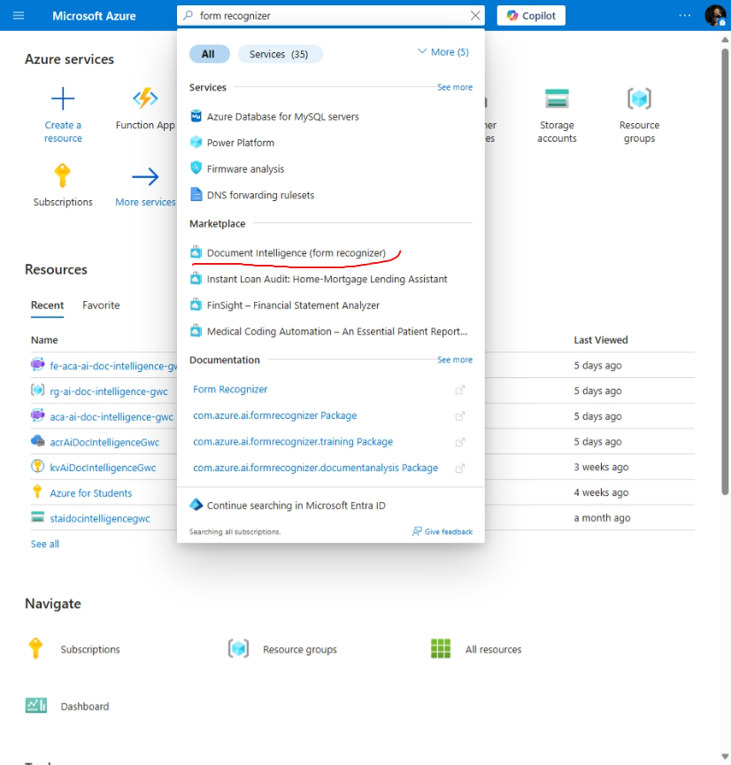
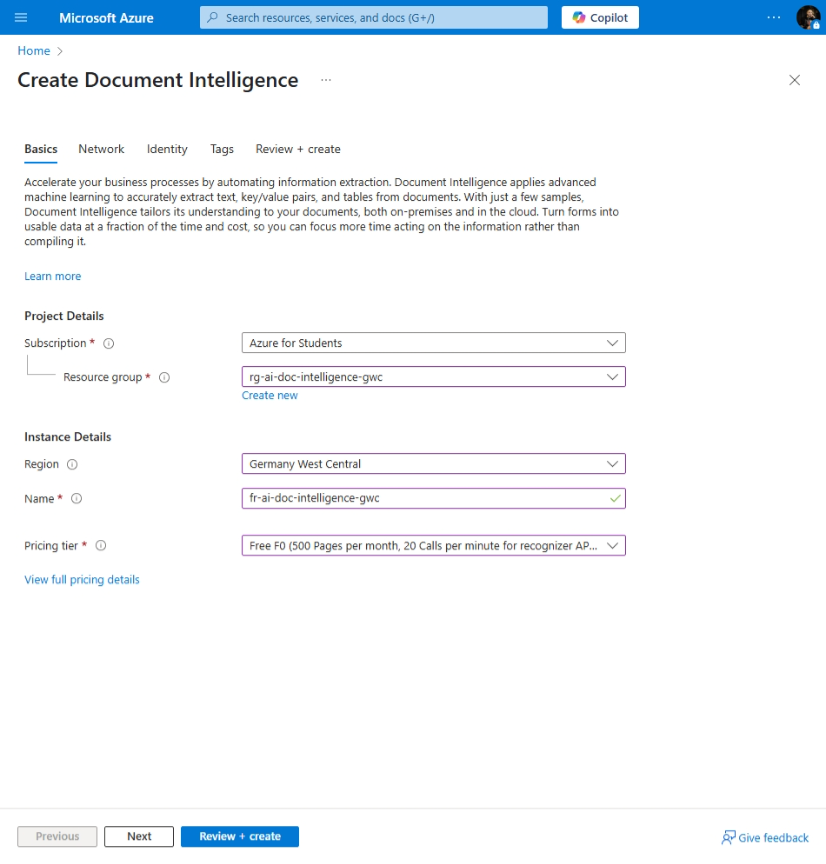

# AI Document Intelligence

[Previous step](../step-07/README.md) - [Next step](../step-09/README.md)

## Step 8 - Create an ASP.NET Core WebApi and deploy it to Kubernetes

1. Create a YAML script to configure a Kubernetes service for the ASP.NET Core WebApi:

```yaml
apiVersion: v1
kind: Service
metadata:
  name: webapi
spec:
  selector:
    app: webapi
  ports:
  - port: 8080
    targetPort: 8080
```

2. Apply it using the Visual Studio Code command palette:



3. Check the Kubernetes Activity pane and locate your newly created service within the Network node:



[Previous step](../step-07/README.md) - [Next step](../step-09/README.md)