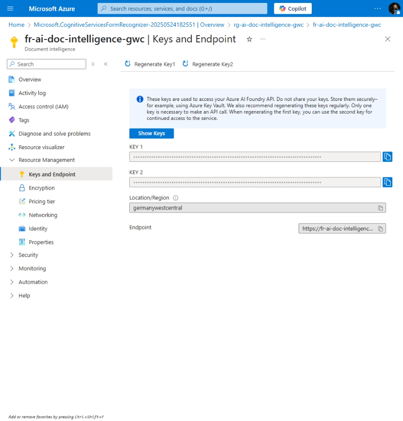
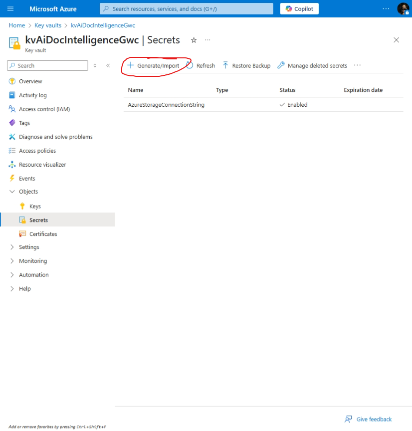
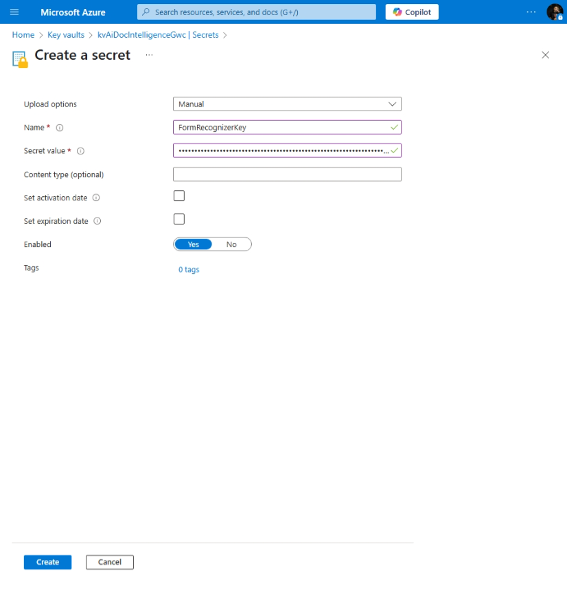
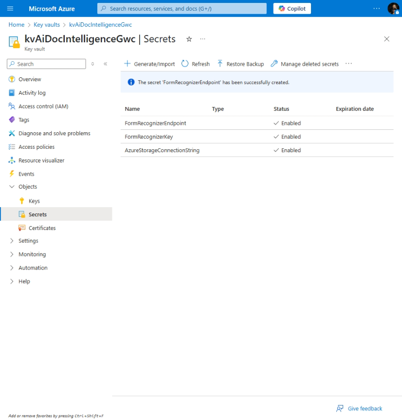

# AI Document Intelligence

[Previous step](../step-07/README.md) - [Next step](../step-09/README.md)

## Step 8 - Set Up Azure AI Form Recognizer

**1.** In the Azure Portal, use the search bar to look for **Form Recognizer** and select it from the results.

**2.** Select your resource group, choose the **Germany West Central** region, name the instance `fr-ai-doc-intelligence-gwc`, select the **Free (F0)** tier, then click **Review + Create** to provision the Form Recognizer.

### Adding Form Recognizer API Endpoint and Key to Azure Key Vault

Since the **Azure Function** sends images to the **Form Recognizer** and retrieves credentials from **Azure Key Vault**, you now need to add the **Form Recognizer API endpoint** and **key** as secrets in the Key Vault. This allows secure access without hardcoding sensitive values.

**3.** Go to your deployed Form Recognizer instance, navigate to **Resource Management > Keys and Endpoint**, and copy both the **KEY 1** and **Endpoint** to a notepad for temporary use.

> ⚠️ **Important:** Once you've added them to Azure Key Vault, **delete the values from your notepad** to keep them secure.

**4.** In the Azure Portal, navigate to your **Key Vault**, go to **Objects > Secrets**, and click the **+ Generate/Import** button to add a new secret.

**5.** To save the **Form Recognizer Key**, set the secret name to `FormRecognizerKey`, paste the copied key into the **Secret value** field, and click **Create**.

**6.** Repeat the process to add the **Form Recognizer endpoint** — name the secret `FormRecognizerEndpoint`, paste the copied endpoint into the **Secret value** field, and click **Create**.

You should now see **3 secrets** in your Azure Key Vault:

* `AzureStorageConnectionString`
* `FormRecognizerKey`
* `FormRecognizerEndpoint`

These will be securely used by your Azure Function and other components in the app.

[Previous step](../step-07/README.md) - [Next step](../step-09/README.md)