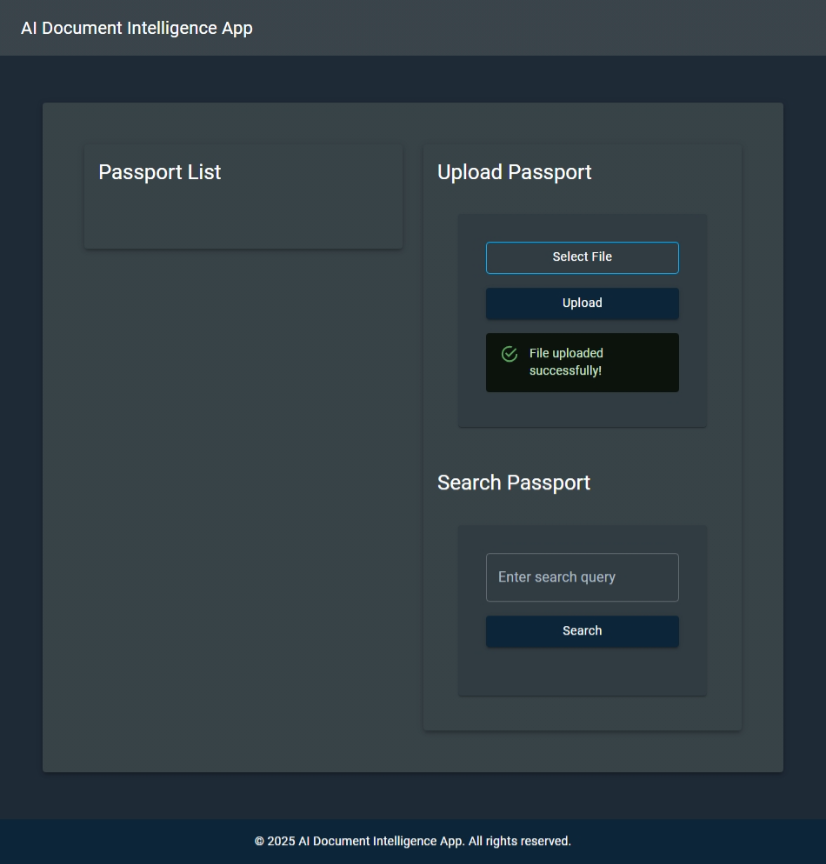

# AI Document Intelligence

[Previous step](../step-10/README.md) - [Next step](../step-12/README.md)

## Step 11 - Locate the Resource Group for Kubernetes Network Resources

**1**. To find the name of the resource group containing all Kubernetes networking components created by Azure, use the following command:

[Previous step](../step-10/README.md) - [Next step](../step-12/README.md)